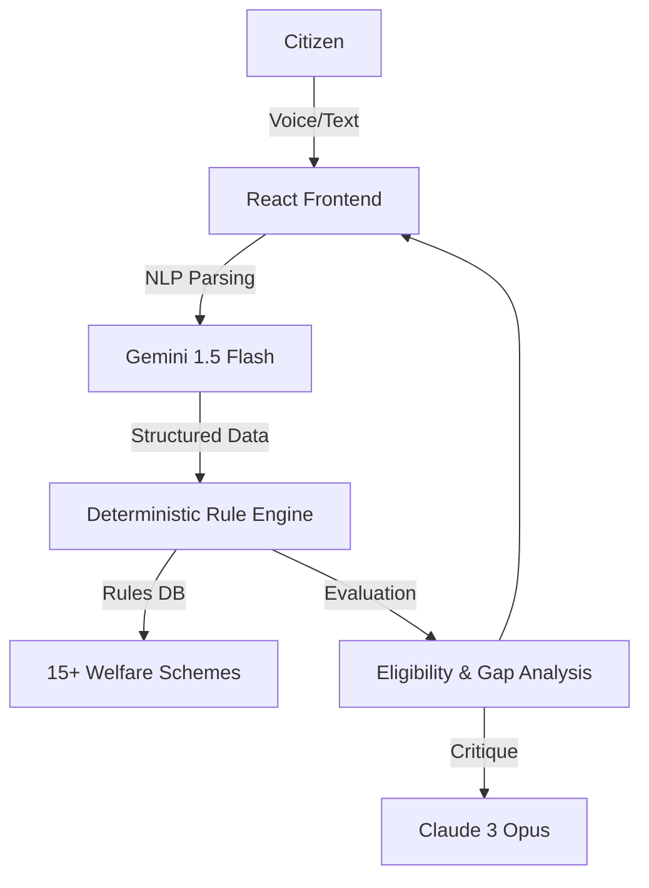

# Project Kalam: System Architecture

Project Kalam is an AI-driven welfare intelligence engine designed to bridge the gap between complex government eligibility criteria and citizens in India.

## 1. System Overview

The application follows a hybrid architecture combining deterministic rule-based evaluation with high-level AI reasoning for natural language interactions.

### Component Diagram

## 2. Technical Decisions

### Decision 1: Client-Side Deterministic Rule Engine
- **Selected**: TypeScript-based rule execution in the browser.
- **Rejected Alternative**: Pure LLM-based eligibility checking.
- **Reasoning**: Welfare eligibility is a legal binary. LLMs are probabilistic and prone to hallucinations (e.g., hallucinating an age limit or income cap). By using a deterministic rule engine (`evaluateRule()`), we guarantee 100% auditability and consistency. The engine handles operators (`eq`, `lt`, `gt`, etc.) on a structured profile.

### Decision 2: Hybrid Hinglish NLP Normalization
- **Selected**: Using Gemini 1.5 Flash to normalize unstructured voice/text input into structured JSON fields.
- **Rejected Alternative**: Manual keyword/regex matching or separate translation layers.
- **Reasoning**: Users in rural India often speak in "Hinglish" or varying dialects. A regex-based approach is brittle. Translation-first approaches lose cultural context. Gemini directly processes the context (e.g., understanding that "shahar mein rehte hain" maps to `isUrban: true`) much more reliably.

### Decision 3: "Uncertainty-First" UI Modeling
- **Selected**: Surfacing an 'Uncertain' state and 'Confidence Scores' for eligibility.
- **Rejected Alternative**: Simple Pass/Fail binary output.
- **Reasoning**: Most welfare applications fail not because the user is ineligible, but because of data mismatch or missing documents. By flagging "Insufficient Data" and applying "Uncertainty Penalties" to confidence scores, we prevent false confidence and guide the user to provide exactly what is missing.

## 3. Production-Readiness Gaps

1.  **Real-Time API Integration (GatiShakti/Umang)**:
    Currently, the system relies on user-provided profile data. In production, this must integrate with government APIs (DigiLocker, Umang) to pull verified records for land ownership, income certificates, and caste certificates to replace self-declaration.

2.  **State-Specific Policy Overlays**:
    Most central schemes (like PMAY or Ayushman Bharat) have state-specific top-ups or exclusion modifications. The system needs a hierarchical rule inheritance model where state-level rules can override or expand upon central guidelines based on the user's `state` field.
